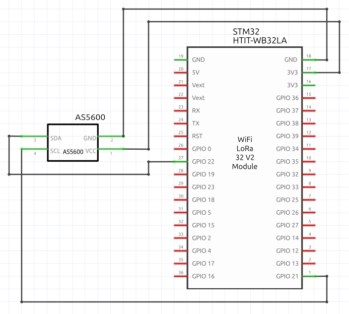

# AS5600_ESP32
Serial communication between AS5600 encoder and ESP32

## Mechanical Contraints
- The magnet must have diametrical magnetization
- The magnet must be centered up respect to the chip
- Perfectly vertical axis
- Distance between magnet and chip: 1 - 3 mm

## Wiring

